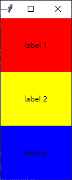

# Python 内置界面开发框架 Tkinter入门篇

# 关于 Tkinter

上期讲过，python 其实有三大流行 GUI 开发框架，包括 PyQt、wxPython 和 Tkinter。wxPython 也在上期文章介绍过，今天给大伙带来 Tkinter 的入门介绍！

Tkinter 是 python 标准库内嵌自带的界面开发框架，算得上是皇亲国戚了。如此火热的 python ，又怎能不了解一下它自带的界面开发框架呢？

Tkinter 有很多强大的地方，比如跨平台特性。同一套代码可以轻松运行在 Windows, macOS, 和 Linux 系统环境下。它的可视化元素都是基于本地系统元素渲染而得，所以和原生开发相比看不出来有什么区别。

另外，Tkinter 和其它 GUI 框架相比非常轻量和简洁。这就带来了很明显的缺点，界面风格有些过时。如果你需要开发光鲜亮丽的应用，可以参考一下我的其它博文，其中可找到其它的解决方案，总有适合你的那一款！而轻量级的优点也是很突出的，如果华丽花哨的可视化于你是无关紧要的话，Tkinter 真的可以拿来即用，也没有繁杂的开发流程，方便专注于功能的快速实现。对于急用的工具型软件，有必要活捉一番 Tkinter。

关于往期相关的文章，有兴趣可前往关注我的微信公众号 englyf 查看，倍感荣幸能得到你的关注！

从这篇文章里，你可以了解到这些信息：
```
Tkinter 应用的基本框架是什么样子？
常用的基本控件有哪些？
除了基本控件，还有主题控件？
怎样布局界面？
如何与界面元素交互？
手把手写一个简单的记事本应用
```

*本文所有代码运行环境基于 win10 x64。*

# 基本框架

好了，八戒为了见 Tkinter 一面，就像娶媳妇一样，匆忙揭开盖头，一睹为快。

新建文件 main.py，先写一个 hello world 吧！

```
import tkinter as tk

window = tk.Tk()
window.title("hello world !")
window.mainloop()
```

可以看到，需要先导入库 tkinter，名字有点长，所以命名为 tk 方便下面的引用。

绝大部分的界面应用都需要一个顶层窗口，这里通过实例化类 Tk 获得。然后在这个顶层窗口的标题栏设置标题，调用方法 title()，传入 hello world。最后，为了响应用户的交互和输入，必须调用主窗口的 mainloop() 以启动事件环。

虽然 tkinter 是 python 标准库的自带 GUI 框架，但是在使用前也得先安装 tk 库。

```
pip install tk
```

安装完，使用 pip list 确认一下

```
Package    Version
---------- -------
pip        22.3.1
setuptools 56.0.0
tk         0.1.0
```

写作时，当前安装的最新版本是 0.1.0。

上面的环境配置指令建议在预先准备好的虚拟环境下执行，至于怎么配置虚拟环境，可以看看我的另一篇文章[《Python：灵活的开发环境》](https://mp.weixin.qq.com/s/WTl7BPAhX5VuK-gmHaErMg)

然后在环境下，输入脚本启动指令

```
python main.py
```

看看跑起来的界面程序什么样子


从上面代码来看，没有冗余的部分，的确是拿来即用。

# 基本控件

下面是一些基本又常用的控件

|控件类|说明|
|-|-|
|Label|文本标签，显示静态文本|
|Button|按键，可点击的按键|
|Frame|矩形区域，组合相关控件|
|Entry|单行输入框，输入单行文本|
|Text|多行输入框，输入多行文本|
|Spinbox|范围输入框，选择指定范围内的值|
|Scale|刻度条，拖动按钮选取数值|
|Progressbar|进度条，显示进度|
|Listbox|列表，显示浏览和选择单行文本项的列表|

篇幅有限，本文着重于入门级别，如果你有需要查找更全面的信息可以继续关注本公众号的后续更新。所以接下来就从上面的表格中挑几个基本的控件来细讲，继续看。

## Label 文本标签

做界面的时候，如果你需要显示一些静态的文本，比如在某些元素前面显示一个名称，那么就可以用到控件 Label。这里要注意，控件 Label 被设计用于向用户显示文本，而不是获取文本。

比如，要显示一行文本 `display text with framework tkinter`

```
import tkinter as tk

window = tk.Tk()
lbl = tk.Label(
    master=window,
    text="display text with tkinter framework",
    fg="white",
    bg="black",
    width=40,
    height=10
    )
lbl.pack()
window.mainloop()
```

实例化类 Label 的时候，演示了传入参数 master，text，fg，bg，width 和 height。

参数 master 用于指定被实例化的控件被放置在哪个父控件中，这里指定将实例化的控件 Label 放置在顶层窗口 window 中。

*注意：如果 master 参数被忽略，那么被实例化的控件就默认被放置在顶层窗口中。*

参数 text 传入的内容就是要显示的文本字符串。

参数 fg 和 bg 分别是 fontground 和 background 的缩写，分别表示字体颜色和背景颜色。可以输入有效的颜色名字，比如 "white"，"black"，"red"，"orange"，"yellow"，"green"，"blue"，"purple"等 ，或者输入 # 开头的 RGB 值，比如 "#34A2FE"。

参数 width 和参数 height 分别用于设置控件的宽高。

要注意的是，上面用到的参数 width 和参数 height 的单位不是像素而是文本单位，1个单位 width 表示文本字符 0 的宽度，1个单位 height 表示文本字符 0 的高度。所以，如果 width 和 height 数值相等，那么实际显示效果也不会是正方形。

像上面说的那样子，单纯创建完控件是无法显示出来的。为了显示控件，还需要调用几何图形管理器(geometry manager)，如代码所示，这里使用的几何图形管理器是 pack。当然也可以选用其它的管理器，在下面的界面布局主题章节中会专门介绍，继续看。

看看显示效果


另外，tkinter 对提供的带有文本的部分控件，比如 Label 等，在实例化时，还有个非常有用的参数 textvariable。这个参数需要传入 tkinter 提供的特定字符串类型的变量。然后，在需要读取和修改控件文本时，可以直接操作传入参数 textvariable 的变量。举个栗子

```
import tkinter as tk

window = tk.Tk()
var_lbl = tk.StringVar()
var_lbl.set("display text with tkinter framework")
lbl = tk.Label(
    master=window,
    fg="white",
    bg="black",
    width=40,
    height=10,
    textvariable=var_lbl
    )
lbl.pack()
print(f"{var_lbl.get()}")
window.mainloop()
```

通过 tkinter 提供的 StringVar() 生成特殊字符串类型的量赋给变量 var_lbl，然后传给控件实例化的参数 textvariable。在读取控件 Label 的文本时，可通过 var_lbl.get() 获取。如果需要修改控件的文本，可通过 var_lbl.set() 传入字符串即可。

执行的程序界面和上面的无异，但是命令终端会有输出

```
(.venv) D:\englyf\python>python main.py
display text with tkinter framework
```

## Button 按键

在界面中，为了触发某些动作，一般通过点击按键来启动。那么，tkinter 是怎么添加按键控件？

下面举个栗子，添加一个带有文本显示 `Click me!` 的按键。

```
import tkinter as tk

window = tk.Tk()
btn = tk.Button(
    text="Click me!",
    width=25,
    height=5,
    bg="blue",
    fg="yellow"
    )
btn.pack()
window.mainloop()
```

参数 text 输入显示的文本字符串，参数 width 输入控件宽度，参数 height 输入控件高度，参数 bg 输入代表背景颜色的名字，参数 fg 输入代表字体颜色的名字。

要注意的是，上面用到的参数 width 和参数 height 的单位同样是文本单位。

控件 Button 同样支持参数 textvariable。

看看显示效果


然后，你可能有疑问，代码中为什么没看到触发动作的内容？莫慌！这个其实属于交互的范畴，在下面的交互章节有专门介绍，继续看。

## Frame 矩形区域

一般界面中，为了显示丰富的功能，经常需要把各种各样的控件组合在一起，那么就需要有控件充当组合粘贴板功能，而控件 Frame 刚好可以担起这个责任。

控件 Frame 用于组合相关控件，或者在控件之间提供填充的矩形区域，所以 Frame 是控件容器，也属于布局的内容，这里提前说说看，方便后边引用控件 Frame 对其它控件的演示。下面举个栗子，在控件 Frame 上添加静态标签 Label 和按键 Button 各一个。

```
import tkinter as tk

window = tk.Tk()
frame = tk.Frame()
label = tk.Label(
    master=frame,
    text="I'm a label in Frame"
    )
label.pack()
button = tk.Button(
    master=frame,
    text="I'm a button in Frame"
    )
button.pack()
frame.pack()
window.mainloop()
```

为了把控件 Label 和 Button 粘贴到控件容器 Frame 中，只需要把控件容器 Frame 的实例引用赋值给各个控件的实例化参数 master 即可。相当于为各个控件指定父控件，那么这里的控件 Label 和 Button 也被称之为子控件。

道理类似于：一个孩子只能有一个父亲，一个父亲却可以有多个孩子。

看看显示效果


可以看到，控件 Label 排在控件 Button 的上面，那么怎么反过来呢？

```
import tkinter as tk

window = tk.Tk()
frame = tk.Frame()
label = tk.Label(
    master=frame,
    text="I'm a label in Frame"
    )
button = tk.Button(
    master=frame,
    text="I'm a button in Frame"
    )
button.pack()
label.pack()
frame.pack()
window.mainloop()
```

看看显示效果


## Entry 单行输入框

界面中一般会有一些输入框，比如现在要介绍的单行文本输入框控件 Entry。如果输入的内容比较少，那么就适合使用这个控件 Entry。

下面举个栗子，添加一个单行文本输入框。

```
import tkinter as tk

window = tk.Tk()
entry = tk.Entry(
    fg="yellow",
    bg="blue",
    width=50
    )
entry.pack()
window.mainloop()
```

实例化单行输入框控件，参数 fg 表示字体颜色，参数 bg 表示背景色，参数 width 也是文本单元的宽度。与其关注输入控件的样色，不如关心一下怎么从输入控件读取内容。

获取全部内容，使用 get()。

清空控件的内容，使用 delete()。输入参数 first 和 last 设置删除的字符索引范围，从 first 开始到 last 结束，不包括 last。last 可以忽略，也可以填 tk.END，表示删除内容到最后位置。

插入内容，使用 insert()。输入参数 index 和 string 设置在索引 index 处，插入内容 string。

控件 Entry 同样支持参数 textvariable。

看看显示效果


## Text 多行输入框

再来看看多行输入框控件 Text。如果输入的内容比较多，需要换行才能比较好地显示，那么就适合使用这个控件 Text。

下面举个栗子，添加一个多行文本输入框。

```
import tkinter as tk

window = tk.Tk()
text = tk.Text(
    fg="yellow",
    bg="blue",
    width=50
    )
text.pack()
window.mainloop()
```

实例化多行输入框控件，输入的参数和控件 Entry 类似，这里略过了。重点说一下对这个控件的内容读写操作。

获取内容，使用 get()。如果没有输入参数，会引起程序执行异常。因为这个方法至少需要输入一个参数 index，用于表示获取的开始位置。还可以输入多一个参数 index，用于表示获取的结束位置，此参数可忽略，若忽略则表示获取内容到最后结束位置。

清空控件的内容，使用 delete()。

插入内容，使用 insert()。输入参数 index 和 chars 设置在索引 index 处，插入内容 chars。index 可以使用类似 `<line>.<column>` 的格式，比如 

```
text.insert("1.2", "Hello")
```

上面的代码，表示在第1行2列处，插入字符串 Hello

看看显示效果


## Spinbox 范围输入框

在有些界面中，也时常会看到有些输入框，只能从指定范围内选取值，并且右侧有向上或向下的箭头按钮，点击向上或向下的箭头可按照步进值对输入框中的值加或减，但不能超过设定的范围值。

下面举个栗子，添加一个这样子的输入框，并且输入范围限定在[0, 100]之间，步进为1。

```
import tkinter as tk

window = tk.Tk()
spinbox = tk.Spinbox(
    master=window,
    from_=0,
    to=100,
    increment=1
    )
spinbox.pack()
window.mainloop()
```

实例化控件 Spinbox，参数 from_ 输入范围的最小值，参数 to 输入范围的最大值，参数 increment 设定步进值。

获取内容，使用 get()，返回值是输入框中的字符串。

删除输入框中的内容，使用 delete()。输入参数 first 和 last，分别指定开始字符的索引和结束字符的索引。如果忽略 last，那么默认 last = first+1。

插入内容，使用 insert()。输入参数 index 和 s，index 代表开始插入的索引，s 表示插入的字符串。

控件 Spinbox 同样支持参数 textvariable。

看看显示效果


## Scale 刻度条

上面经已介绍的那些控件在动态修改数值时，对于用户来说还是不太方便。为了更方便地修改数值，比如用户可以按住鼠标键直接拖动控件时，数值就会跟着变动，刻度条控件 Scale 就刚好可以实现这样的功能。

下面举个栗子，在主界面添加一个刻度条控件。

```
import tkinter as tk

window = tk.Tk()
scale = tk.Scale(
    master=window,
    orient=tk.VERTICAL,
    length=150,
    from_=0,
    to_=200
    )
scale.pack()
window.mainloop()
```

实例化控件 Scale，参数 orient 指定刻度条方向（VERTICAL 对应垂直方向，HORIZONTAL 对应水平方向），参数 length 设定控件长度（单位为像素）， 参数 from_ 设置数值范围的最小值，参数 to 设置数值范围的最大值。

获取控件 Scale 的当前值，使用 get()，返回整数值或者浮点数。

设置控件 Scale 的当前值，使用 set()，输入设置的数值。

看看显示效果


拖动中间的滑块，把控件当前值拉到168。

## Listbox 列表

如果有很多类似的内容需要显示给用户，那么就适合用到列表控件 Listbox。控件 Listbox 用于显示单行文本项的列表，允许用户浏览列表内容，并且选择一个或多个选项。

举个例子使用控件 Listbox 来显示花名单

```
import tkinter as tk

window = tk.Tk()
contents = ["贵爷", "蔡礼佛", "梁老师", "鸡毛", "胖子"]
listvar = tk.StringVar(value=contents)
listbox = tk.Listbox(
    window,
    bd=2,
    bg="#dddddd",
    listvariable=listvar
    )
listbox.grid()
contents.append("助班")
listvar.set(contents)
window.mainloop()
```

实例化控件 Listbox 时，也使用了一个方便快速操作内部数据的参数 listvariable，类似其它控件的 textvariable 参数，但是由于列表控件内部管理的是文本列表，所以 listvariable 接收的量必须是列表类型[]。先是直接创建一个列表量，然后传入 StringVar() 转换成特殊格式返回，返回值 listvar 再赋给控件 Listbox 实例化的参数 listvariable。在后边需要更新或读取列表控件内容时，直接调用 listvar.set() 或 listvar.get() 即可。

控件 Listbox 其实是有自带的接口可以操作内部数据的，但是相对于初始化 listvariable 参数来说太硬核了，不够灵活，所以不展开了。

看看显示效果


# 主题控件

Tkinter 框架提供了一部分支持切换主题外观的控件，这些控件包含在 tkinter.ttk 模块(主题模块)内，这些控件被称为主题控件。比如，前面介绍的那些基本控件，在主题模块里基本都有相应的主题版本可供使用，这就使得 tkinter 做出来的界面可观性提高了不少。

另外基本控件和主题控件的 API 基本类似，只有少量差异，所以可以轻松切换使用。

## 基本控件快速切换到主题控件

如果遗留代码里使用的是基本控件，为了能使用主题控件来快速覆盖，在导入库时可以参考使用通配符 import （*），这样就不需要大范围修改代码了。

先看下假设的遗留代码，代码中只有个按钮 Button。

```
from tkinter import *

window = Tk()
btn = Button(
    text="Click me!",
    width=25
    )
btn.pack()
window.mainloop()
```

显示效果是这样子


然后添加导入主题模块 ttk

```
from tkinter import *
from tkinter.ttk import *

window = Tk()
btn = Button(
    text="Click me!",
    width=25
    )
btn.pack()
window.mainloop()
```

看看新的显示效果


看起来主题控件风格的确和基础控件有所不同，主题控件相对更现代一些。

那么为什么呢？往下看。

## 切换主题

主题库既然支持切换主题，那么怎么切换到不同的主题？又有哪些主题可供选择呢？

不同的主题其实就分别对应不同的样式，而 tkinter.ttk 模块提供了 Style 类用于操作主题控件样式。

直接看下面的示例代码

```
from tkinter import *
from tkinter.ttk import *

window = Tk()
style = Style()
print(style.theme_names())
print(style.theme_use())
btn = Button(
    text="Click me!",
    width=25
    )
btn.pack()
window.mainloop()
```

执行的程序界面和上面的无异，但是命令终端会有输出

```
(.venv) D:\englyf\python>python main.py
('winnative', 'clam', 'alt', 'default', 'classic', 'vista', 'xpnative')
vista
```


上面代码调用 Style 类实例的 theme_names() 返回 tkinter 支持的所有主题类型('winnative', 'clam', 'alt', 'default', 'classic', 'vista', 'xpnative')。

调用 theme_use() 输入为空，返回默认的主题类型，这里是 vista。如果需要改变主题类型，可以调用 theme_use() 输入对应的主题名字即可。如果设置主题类型为 winnative，你会留意到控件的风格就变得和基本控件的一致，看来还是 vista 更现代一些。

然后，简单介绍一下部分其它的主题控件，比如进度条 Progressbar。

## Progressbar 进度条

有些情况下，某些操作比较耗时间，而用户也不知道这操作到底还要花多长时间时，你就有必要告诉用户剩余的操作时间了。为了形象体现出剩余时间或者已执行进度，可以使用控件 Progressbar。

下面举个栗子，在主界面添加一个进度条控件。

```
import tkinter as tk
import tkinter.ttk as ttk

window = tk.Tk()
progressbar = ttk.Progressbar(
    master=window,
    maximum=50,
    value=50
    )
progressbar.pack()
window.mainloop()
```

看看显示效果


# 界面布局

关于 Tkinter 框架的 GUI 布局，其实官方没有提供对应的图形化工具可用，但是网上有一些开源的小工具可以使用。这里不打算介绍这些小工具的使用，而是直接用框架提供的几何图形管理器来布局，比如上面提到过的 pack() 就是其中一种。这里提到的几何图形管理器也就是其它框架里常说的布局管理器。

Tkinter 框架提供的布局管理器有：pack、grid、place 三种。每一个控件只可以使用一种布局管理器，不同控件使用的布局管理器可以不一样。

## pack

形象点说， pack 就是把控件包装在一个矩形区域，这个区域大小足够放置控件，而且默认置中。pack 是最简单的布局管理器，也称之为包装布局。

直接试一试用 pack 来布局三个静态标签 Label，默认设置(pack() 传入参数为空)

```
import tkinter as tk

window = tk.Tk()
lbl_1 = tk.Label(
    master=window,
    text="label 1",
    fg="black",
    bg="red",
    width=10,
    height=5
    )
lbl_1.pack()
lbl_2 = tk.Label(
    master=window,
    text="label 2",
    fg="black",
    bg="yellow",
    width=10,
    height=5
    )
lbl_2.pack()
lbl_3 = tk.Label(
    master=window,
    text="label 3",
    fg="black",
    bg="blue",
    width=10,
    height=5
    )
lbl_3.pack()
window.mainloop()
```

看看显示效果


可以看到，默认 pack 会在父窗口 window 中垂直方向按顺序包装排列这三个静态标签 Label。

那么，如果我需要让这几个标签水平排列呢？可以这样子改

```
lbl_1.pack(side=tk.LEFT)
...
lbl_2.pack(side=tk.LEFT)
...
lbl_3.pack(side=tk.LEFT)
```

看看显示效果


pack(side=tk.TOP) 和默认设置等价。

简单汇总介绍一下其它的参数

|参数|赋值|说明|
|-|-|-|
|after|控件 widget|将此控件包装在控件 widget 后边|
|anchor|NSEW (or subset)|根据方向定位此控件，NSEW 表示北南东西四个方向|
|before|控件 widget|将此控件包装在控件 widget 前边|
|expand|bool 类型值|跟着父控件一起伸缩|
|fill|NONE、X、Y、BOTH|选择当控件伸缩时按照哪个方向填充|
|ipadx|amount|在x方向添加内部填充|
|ipady|amount|在y方向添加内部填充|
|padx|amount|在x方向添加填充|
|pady|amount|在y方向添加填充|
|side|TOP、BOTTOM、LEFT、RIGHT|把控件往哪边添加|

很多时候开发界面都需要让里边的控件跟随窗口自动拉伸大小，来看一下上面的代码应该怎么改

```
lbl_1.pack(fill=tk.BOTH, expand=tk.TRUE)
...
lbl_2.pack(fill=tk.BOTH, expand=tk.TRUE)
...
lbl_3.pack(fill=tk.BOTH, expand=tk.TRUE)
```

启动的时候，还没有拉伸窗口



然后拉伸看看


## grid

如名字表述，grid 会把父窗口划分成行列，然后根据调用时传入参数 row，column 确定把控件放置在对应的行列中。grid 也称之为格子布局。

还是以静态标签为例，创建 3x3 的矩阵标签。为了凸显各个标签的边界，这里还需要添加 Frame 控件，每个标签放置于单独的 Frame 中。

```
import tkinter as tk

window = tk.Tk()

for i in range(3):
    for j in range(3):
        frame = tk.Frame(
            master=window,
            relief=tk.RAISED,
            borderwidth=1
        )
        frame.grid(row=i, column=j)
        label = tk.Label(
            master=frame,
            text=f"Row {i}\nColumn {j}"
            )
        label.pack()

window.mainloop()
```

可以看到，上面这个例子布局时，只有 Frame 才需要应用 grid 管理器，因为每个标签和 Frame 一一对应，所以标签不需要重复应用格子布局。

看看显示效果


简单汇总介绍一下其它的参数

|参数|赋值|说明|
|-|-|-|
|column|列序号|指定放置的列，从0开始|
|columnspan|列数|放置的控件横跨多少列|
|ipadx|amount|在 x 方向添加内部填充|
|ipady|amount|在 y 方向添加内部填充|
|padx|amount|在 x 方向添加外部填充|
|pady|amount|在 y 方向添加外部填充|
|row|行序号|指定放置的行，从0开始|
|rowspan|number|放置的控件横跨多少行|
|sticky|NSEW|如果单元格比较大，那么控件的指定边界将贴着单元格。NSEW分别对应顶部、底部、右边、左边边界|

细心的朋友会发现，一旦拉伸上面的那个矩阵标签窗口，窗口界面就会露出部分底面，矩阵标签没有跟随一起拉伸。


这样明显和我们的预期不符合，这个问题怎么解决呢？

可以调用父窗口的 columnconfigure() 和 rowconfigure() 方法配置各列和行的伸缩比。这两个方法都有三个输入参数，看下面的表格

|参数|说明|
|-|-|
|index|序号，指定特定的行或列，可以是单个行列序号值，也可以是代表多个行或列的列表|
|weight|伸缩权重|
|minsize|最小宽度值|

现在来看看怎么改，才能让矩阵标签跟随父窗口一起拉伸？

```
import tkinter as tk

window = tk.Tk()

for i in range(3):
    window.rowconfigure(i, weight=1)
    window.columnconfigure(i, weight=1)

    for j in range(3):
        frame = tk.Frame(
            master=window,
            relief=tk.RAISED,
            borderwidth=1
        )
        frame.grid(row=i, column=j)
        label = tk.Label(
            master=frame,
            text=f"Row {i}\nColumn {j}"
            )
        label.pack()

window.mainloop()
```

看看拉伸之后的显示效果


perfect！另外需要提一下，grid 具有 pack 能做的所有功能，但是使用的形式更简单，因此应该作为更优先的布局管理器。

## place

place 用于对控件精确定位的场合。使用的时候需要传入参数 x 和 y 分别用于指定控件的放置位置坐标值 x 和 y，传入的 x 和 y 是基于父控件的左上角为原点的坐标系，单位是像素点。

大多数界面应用里，控件都不需要精确的定位。但是某些，比如地图应用里，就的确需要对元素的精确定位了。

下面举个栗子，在窗口里不同位置放置各一个标签

```
import tkinter as tk

window = tk.Tk()

label1 = tk.Label(
    master=window,
    text="place (0, 0)",
    bg="yellow"
    )
label1.place(x=0, y=0)

label2 = tk.Label(
    master=window,
    text="place (40, 40)",
    bg="blue"
    )
label2.place(x=40, y=40)

window.mainloop()
```

看看上面代码的显示效果


说回来，place 的参数xy单位是像素，那么在不同的系统下，字体类型和大小都是不同的，那么被放置的控件就有可能超出窗口边界。因此 place 真的不常用，关于 place 进一步的信息就不再展开了。

# 交互

上面介绍的内容都仅限于 Tkinter 界面的可视化设计，那么现在是时候介绍一下Tkinter 界面和用户的互动了。

比如，Tkinter 界面对于事件的响应是怎么发生的？

一般，在 Tkinter 中通过预先绑定事件和响应处理函数，每当事件发生时，主窗口的 mainloop 就会收到事件，然后根据绑定信息，查找到响应处理函数并调用，来达到交互的效果。绑定的通用方法是调用各个控件的 bind()。

比如，下面我们来实现一个简单的键盘响应互动，每次按键按下时就把对应的按键打印出来

```
import tkinter as tk

def handle_keypress(event):
    print(event.char)

window = tk.Tk()
window.bind("<Key>", handle_keypress)
window.mainloop()
```

上面的代码没有添加额外的控件，除了有个空白的主窗口。其中，对主窗口 window 绑定了按键事件 Key 和处理函数 handle_keypress。

调用 bind() 最少要求输入两个参数，一个是形式为 "<event_name>" 的事件，另一个是事件处理函数。

定义处理函数 handle_keypress 时，唯一做的事情是把传入的事件字符打印到标准终端。


每当按下键盘的按键，命令行终端就会输出对应的按键。

但是，对于按钮 Button 来说，点击事件的触发处理可以不需要使用 bind()，仅需要在实例化控件 Button 时，传入处理函数给 command 参数即可，初始化过程会自动绑定 click 事件的响应。


上代码看看

```
import tkinter as tk

def handle_keypress():
    print("clicked")

window = tk.Tk()
button = tk.Button(
    master=window,
    text="click me!",
    command=handle_keypress
    )
button.pack()
window.mainloop()
```

运行程序


用鼠标点击一下界面上的按钮，发现终端会输出字符串 clicked

# 实现一个简单的记事本应用

前面说了这么多，用句流行语来概括就是 「散装知识点」。为了串联起来有个全面的体会，下面让我们一起来实现一个简单的记事本程序吧！

作为一个产品的开发来看的话，我们需要清楚地知道自己到底想要的产品是长什么样子，然后才是实现的过程。

我们打算做一个基本的记事本，它可以点击按键打开 TXT 格式的文本文件，把文件内容读取出来显示在编辑区，然后在编辑区修改了文件内容后，又可以点击其它按键把编辑区的内容另存为其它文本文件。

按照上面的功能需求定义，就可以给记事本定个草图啦，长这样


可以看到，它需要先有个主窗口

```
import tkinter as tk

window = tk.Tk()
window.mainloop()
```


然后，应该有个标题栏，上面显示有软件名称 「记事本」

```
import tkinter as tk

window = tk.Tk()
window.title("记事本")
window.mainloop()
```


从草图来看，它还需要功能按钮区域和文本编辑区，可以使用 grid 布局管理器来划分区域。总体可以划分为 1 行 2 列，第 1 列是功能按钮区域，第 2 列是文本编辑区；第 1 行第 1 列也就是功能按钮区域，又可以划分为 2 行 1 列，第 1 行是按钮打开，第 2 行是按钮另存。

对界面布局做好划分之后，就开始添加控件了

```
import tkinter as tk

window = tk.Tk()
window.title("记事本")

btn_frame = tk.Frame(
    master=window,
    bd=2
    )
btn_open = tk.Button(
    master=btn_frame,
    text="打开"
    )
btn_save_as = tk.Button(
    master=btn_frame,
    text="另存"
    )

btn_open.grid(row=0, column=0)
btn_save_as.grid(row=1, column=0)
btn_frame.grid(row=0, column=0)

txt_edit = tk.Text(master=window)
txt_edit.grid(row=0, column=1)

window.mainloop()
```

显示是这样


看起来已经和草图很接近了，不过按钮的布局还是需要调整，位置应该处于所属列的顶部，而且按钮太靠边了。还有，窗体在拉伸之后，控件也没有跟随变化。这几个问题怎么修复呢？

为了将按钮置顶，可以对控件 btn_frame 应用上下拉满，sticky 设为 "ns"。

而按钮太靠边，可以通过修改填充属性 padding，比如 padx=5, pady=5 让控件的边框收缩 5 个像素，保持距离感。

而控件没有跟随窗体一起拉伸，是因为控件 txt_edit 还需要设置所有边框靠着边界，比如 sticky 设为 "nsew" 即可。

看看修改后的代码

```
import tkinter as tk

window = tk.Tk()
window.title("记事本")

window.rowconfigure(
    0,
    minsize=100,
    weight=1
    )
window.columnconfigure(
    1,
    minsize=100,
    weight=1
    )

btn_frame = tk.Frame(
    master=window,
    bd=2
    )
btn_open = tk.Button(
    master=btn_frame,
    text="打开"
    )
btn_save_as = tk.Button(
    master=btn_frame,
    text="另存"
    )

btn_open.grid(
    row=0,
    column=0,
    sticky="ew",
    padx=5,
    pady=5
    )
btn_save_as.grid(
    row=1,
    column=0,
    sticky="ew",
    padx=5
    )
btn_frame.grid(
    row=0,
    column=0,
    sticky="ns"
    )

txt_edit = tk.Text(master=window)
txt_edit.grid(
    row=0,
    column=1,
    sticky="nsew"
    )

window.mainloop()
```

跑起来试一下


OK ! UI 界面视觉效果达到预期了。下一步就是补充逻辑功能，让记事本能读写文本文件。

先看怎么实现打开逻辑。

*理一下思路：* 点击按钮「打开」，程序就会弹出选取文件的窗口，选中文件后点击确定就返回选中的文件路径，然后按照文件路径把文件内容读取出来并且显示到编辑框中。另外，为了让用户知道最终显示的内容来自哪个文件，所以可以把文件路径添加到窗口的标题栏最前面。看怎么修改代码

```
...

def open_file():
    file_path = filedialog.askopenfilename(
        filetypes=[
            ("Text files", "*.txt"),
            ("All files", "*.*")
            ]
    )
    if not file_path:
        window.title("无标题 - 记事本")
        return
    window.title(f"{file_path} - 记事本")
    txt_edit.delete("1.0", tk.END)
    with open(
        file_path,
        mode="r",
        encoding="utf-8") as input_file:
        txt_edit.insert(
            tk.END,
            input_file.read()
            )

...

btn_open = tk.Button(
    master=btn_frame,
    text="打开",
    command=open_file
    )

...
```

上面代码的修改点是添加了一个响应函数 open_file，这个函数用于打开文本文件并读取文件内容显示，然后在实例化按钮控件 btn_open 时，把响应函数 open_file 赋值给参数 command 即可。

为了测试记事本的显示文本内容功能，我们先手动在桌面创建一个文本文件 test.txt，然后输入内容并保存

```
这是测试文本文件
...
```

运行一下程序，然后点击「打开」按钮，选中刚刚创建的文件 test.txt 并打开


可见读取文本内容的目标功能基本达成，再看怎么实现另存逻辑。

*理一下思路：* 点击按钮「另存」，程序就会弹出选择保存文件的路径的窗口，选中路径后点击确定就返回选中的路径，然后按照路径把编辑框中的内容保存为文件。另存后，窗口标题栏也需要相应改变。看怎么修改代码

```
...

def save_as_file():
    file_path = filedialog.asksaveasfilename(
        defaultextension=".txt",
        filetypes=[
            ("Text files", "*.txt"),
            ("All files", "*.*")
            ]
    )
    if not file_path:
        return
    with open(
        file_path,
        mode="w",
        encoding="utf-8") as output_file:
        output_file.write(txt_edit.get("1.0", tk.END))
    window.title(f"{file_path} - 记事本")

...

btn_save_as = tk.Button(
    master=btn_frame,
    text="另存",
    command=save_as_file
    )

...
```

上面代码的修改点是添加了一个响应函数 save_as_file，这个函数用于选择另存文件位置并把编辑框内容写入指定位置文件，然后在实例化按钮控件 btn_save_as 时，把响应函数 save_as_file 赋值给参数 command 即可。

为了测试记事本的文件另存功能，我们先用我们最新修改的记事本程序打开上面手动创建的文本文件 test.txt，然后在编辑框把内容修改一下


点击「另存」按钮，弹出「另存为」文件窗口，找到保存位置并输入新文件名 test_save_as.txt，最后点击「保存」。


另存完毕后，窗口标题内容变成了新文件路径。

好了，一个简单的记事本程序就这样完成了。希望上面的内容能打开你的思路！

# 打包部署

关于 python 输出独立可执行应用的介绍，其实和用什么 GUI 框架无关，所以可参考一下我的另一篇文章《Python：界面开发，wx入门篇》里的相关介绍。

*如需要完整示例代码，可前往 github 仓库获取：* git@github.com:ifi-leung/python_gui_tkinter.git